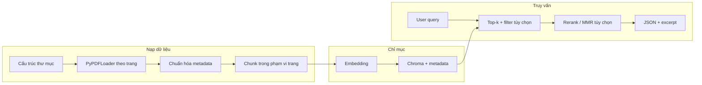

# Kế hoạch: RAG truy xuất chính xác theo trang slide

## Bối cảnh so với code hiện tại

- [SimpleLoader.load_pdf_courses](d:/UIT/DATN/RAG-Tutorial/src/base/loader.py): mỗi thư mục con = `course_name`; mỗi trang PDF = một `Document` (PyPDFLoader); metadata có `course`, `source` (đường dẫn đầy đủ). **Chưa có** `lecture_name` / `lecture_id` nếu cấu trúc là `course/lecture/*.pdf` — hiện `rglob` gom PDF nhưng không ghi nhận tên thư mục buổi học.
- [TextSplitter](d:/UIT/DATN/RAG-Tutorial/src/base/splitter.py): `RecursiveCharacterTextSplitter` (400/120) — **một trang có thể thành nhiều chunk**; metadata trang thường được kế thừa xuống mọi chunk của trang đó (LangChain), nên **định vị trang vẫn đúng** nếu `page` được chuẩn hóa.
- [VectorDB](d:/UIT/DATN/RAG-Tutorial/src/rag/vector_db.py): Chroma + `similarity`, `k=4`; metadata đi theo document vào collection.
- [OfflineRAG](d:/UIT/DATN/RAG-Tutorial/src/rag/rag_pipeline.py): chỉ trả lời text qua LLM — **chưa** trả JSON `{course, lecture, slide, page, content}`.

---

## 1. Kiến trúc từng bước



1. **Quy ước cấu trúc thư mục** (khuyến nghị): `DATA_DIR/<course_name>/<lecture_name_or_id>/*.pdf` — mỗi PDF = một file slide (hoặc một buổi gồm nhiều file). Tên file PDF = `slide_file` (ví dụ `L03_neural_networks.pdf`).
2. **Parse PDF**: Giữ mô hình **một `Document` = một trang** (như hiện tại) để `page_number` luôn gắn với đúng trang vật lý.
3. **Chunk**: Chỉ split **trong nội dung một trang** (không gộp trang). Mỗi vector = một phần của **một** trang + cùng bộ metadata khóa học/buổi/file/trang.
4. **Embedding**: Một vector mỗi chunk; metadata đi kèm mỗi bản ghi Chroma.
5. **Retrieval**: `similarity_search` / `similarity_search_with_score` với `k` đủ lớn → (tùy chọn) reranker hoặc MMR → **dedupe theo (slide_file, page_number)** khi trình bày top-k vị trí cho người dùng.
6. **Output**: Ưu tiên **danh sách hit có cấu trúc**; sinh câu trả lời dài là tùy chọn phía sau.

---

## 2. Schema metadata (mẫu)

**Trên mỗi chunk (và trong Chroma):**

| Trường         | Kiểu              | Ghi chú                                                                                                                                                |
| -------------- | ----------------- | ------------------------------------------------------------------------------------------------------------------------------------------------------ |
| `course_name`  | string            | Tên môn (thư mục cấp 1)                                                                                                                                |
| `lecture_name` | string            | Tên buổi / session (thư mục cấp 2) hoặc suy ra từ tên file nếu phẳng                                                                                   |
| `lecture_id`   | string (optional) | Slug ổn định, ví dụ `CS101_week3`                                                                                                                      |
| `slide_file`   | string            | **Tên file** PDF, không bắt buộc full path                                                                                                             |
| `slide_path`   | string (optional) | Đường dẫn đầy đủ để mở file / debug                                                                                                                    |
| `page_number`  | int               | **1-based** cho UX (slide “trang 5”) hoặc thống nhất 0-based nếu nội bộ — quan trọng là **một chuẩn** và map từ metadata PyPDF (`page` thường 0-based) |

**JSON trả về cho mỗi hit (theo yêu cầu):**

```json
{
  "course": "Machine Learning",
  "lecture": "Week 03 - Neural Networks",
  "slide": "L03_neural_networks.pdf",
  "page": 12,
  "content": "…đoạn text liên quan trong chunk…"
}
```

---

## 3. Chiến lược chunking — lý do và cân bằng ngữ cảnh / độ chính xác

**Chọn: chunk trong biên một trang (page-boundary), có overlap nhỏ.**

- **Vì sao**: Embedding cả trang dài có thể **loãng** tín hiệu (nhiều khái niệm một vector → similarity kém với truy vấn hẹp). Chunk nhỏ hơn **tăng khả năng** khớp đoạn đúng, nhưng vẫn giữ **cùng `page_number`** → định vị trang không bị mờ như khi gộp nhiều trang.
- **Cân bằng**:
  - Chunk **lớn** (gần full page): ngữ cảnh tốt cho đọc hiểu, nhưng truy vấn cụ thể dễ **rank thấp**.
  - Chunk **nhỏ** (đoạn ~256–512 token hoặc ký tự tương đương): precision tốt hơn; overlap (ví dụ 10–20%) giảm mất thông tin ở ranh giới câu.
- **Cải tiến có thể**: sliding window trong trang; hoặc **hai tầng index** (page-level + chunk-level) — tốn chi phí lưu trữ và đồng bộ, dùng khi slide rất dày.

---

## 4. Thiết kế indexing (Chroma) — vì sao truy được đúng trang

- Mỗi **embedding** gắn với **một bản ghi** có metadata đầy đủ → kết quả truy vấn vector trả về không chỉ “tài liệu” mà **cặp (slide_file, page_number)** cụ thể.
- **Lọc metadata** (`where` trong Chroma): ví dụ chỉ tìm trong một `course_name` hoặc một `lecture_id` → giảm nhiễu semantic, **tăng precision** có chủ đích.
- **Khóa logic** (ứng dụng): `location_key = f"{slide_file}::{page_number}"` để gom/dedupe nhiều chunk cùng trang khi hiển thị “top buổi/trang”.

---

## 5. Retrieval — top-k + metadata + precision cao hơn similarity thuần

1. **Top-k**: Lấy `k` lớn hơn (ví dụ 20) rồi **rerank** (cross-encoder nhẹ) hoặc dùng **MMR** để cân diversity — giảm trùng lặp cùng một slide.
2. **Điều kiện lọc**: Nếu UI/API có chọn môn/buổi → `where` trên Chroma.
3. **Kết hợp từ khóa (hybrid)** — khi triển khai scale: BM25 (Lucene/Elasticsearch) + vector merge (RRF) — câu hỏi có **tên thuật ngữ/số/ký hiệu** mà embedding bỏ sót vẫn bám đúng trang.
4. **Ngưỡng score / distance**: Loại bỏ hit quá xa (distance > ngưỡng) để tránh “bịa” vị trí.
5. **Dedupe theo trang**: Sau rerank, chọn tối đa 1–2 chunk **mỗi (slide_file, page)** để danh sách kết quả là **danh sách vị trí** rõ ràng.

**Lưu ý**: Mục tiêu của bạn là **độ chính xác vị trí** — pipeline nên có API `**search(query) -> List[LocationHit]` tách khỏi LLM; LLM chỉ tùy chọn để tóm tắt từ các hit.

---

## 6. Pseudocode / hướng code Python (khớp stack hiện tại)

**Gán metadata khi load (mở rộng loader):**

```python
# Sau khi load từng trang:
rel = pdf_file.relative_to(course_path)
lecture_part = rel.parts[0] if len(rel.parts) > 1 else "default"
doc.metadata["course_name"] = course_path.name
doc.metadata["lecture_name"] = lecture_part
doc.metadata["slide_file"] = pdf_file.name
doc.metadata["slide_path"] = str(pdf_file)
doc.metadata["page_number"] = int(doc.metadata.get("page", 0)) + 1  # 1-based
```

**Chunk chỉ trong trang** (ý tưởng): dùng `RecursiveCharacterTextSplitter.split_documents([single_page_doc])` lần lượt từng trang, hoặc `split_text` trên `page_content` rồi tạo `Document` mới với metadata copy — đảm bảo không có chunk nào chứa text hai trang.

**Truy vấn có metadata đầy đủ:**

```python
results = vectorstore.similarity_search_with_score(query, k=20)
hits = []
for doc, score in results:
    hits.append({
        "course": doc.metadata["course_name"],
        "lecture": doc.metadata["lecture_name"],
        "slide": doc.metadata["slide_file"],
        "page": doc.metadata["page_number"],
        "content": doc.page_content,
        "score": float(score),
    })
# dedupe / rerank / sort theo score
```

**Tích hợp Chroma filter** (khi cần): dùng `Chroma` underlying collection hoặc API LangChain hỗ trợ `filter` trên metadata (theo phiên bản `langchain_chroma`).

---

## 7. Thực thi trong repo này (file chạm tới)

| Hạng mục                    | File                                                                                                       | Việc làm gợi ý                                                                                                                                             |
| --------------------------- | ---------------------------------------------------------------------------------------------------------- | ---------------------------------------------------------------------------------------------------------------------------------------------------------- |
| Cấu trúc thư mục + metadata | [src/base/loader.py](d:/UIT/DATN/RAG-Tutorial/src/base/loader.py)                                          | Suy ra `lecture_name` từ `relative_to(course_path)`; thêm `course_name`, `slide_file`, `page_number` (1-based); giữ `source` hoặc đổi tên rõ `slide_path`. |
| Page-boundary chunking      | [src/base/splitter.py](d:/UIT/DATN/RAG-Tutorial/src/base/splitter.py)                                      | Thêm phương thức `split_per_page(docs)` lặp từng doc một trang.                                                                                            |
| Retriever + JSON            | [src/rag/vector_db.py](d:/UIT/DATN/RAG-Tutorial/src/rag/vector_db.py) hoặc module mới `location_search.py` | Hàm `search_locations(query, k, filters)` trả list dict chuẩn.                                                                                             |
| CLI / demo                  | [main.py](d:/UIT/DATN/RAG-Tutorial/main.py)                                                                | Chế độ in JSON hits; tách khỏi vòng lặp chỉ hỏi LLM.                                                                                                       |
| (Tùy chọn) Rerank           | mới hoặc pipeline                                                                                          | `sentence-transformers` cross-encoder trên cặp (query, chunk).                                                                                             |

Manifest [write_rag_manifest](d:/UIT/DATN/RAG-Tutorial/src/rag/vector_db.py) nên **invalid hóa index** khi schema metadata đổi (thêm khóa vào manifest hoặc version).

---

## 8. Best practices khi scale

- **Incremental index**: theo dõi hash file + số trang; chỉ embed lại PDF/slide thay đổi.
- **Tách collection**: theo `course_name` hoặc năm học → giảm không gian tìm kiếm và dễ xóa môn.
- **Giám sát**: log query → hit metadata; đánh giá offline bằng tập Q&A có nhãn `(slide_file, page)` (Recall@k vị trí).
- **PDF khó**: OCR pipeline riêng cho scan; lưu `page_number` vẫn theo trang PDF sau OCR.
- **Đa ngôn ngữ**: giữ embedding đa ngữ (đã có `paraphrase-multilingual-MiniLM-L12-v2`) hoặc model lớn hơn nếu chất lượng không đủ.

---

## Trade-off tóm tắt

| Hướng                             | Ưu                             | Nhược                                        |
| --------------------------------- | ------------------------------ | -------------------------------------------- |
| 1 vector / trang                  | Đơn giản, 1 hit = 1 trang      | Slide dễ “loãng”, precision truy vấn hẹp kém |
| Nhiều chunk / trang (khuyến nghị) | Khớp truy vấn chi tiết tốt hơn | Cần dedupe theo trang khi hiển thị           |
| Hybrid BM25 + vector              | Khớp ký hiệu/tên riêng         | Hạ tầng phức tạp hơn                         |

---

Kế hoạch triển khai mã sau khi bạn xác nhận: mở rộng loader + splitter theo page-boundary, thêm lớp `search_locations` trả JSON, cập nhật `main`/manifest tùy nhu cầu demo luận văn.
